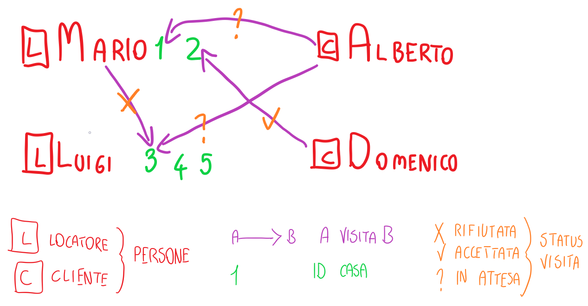

# IAW-exam-1
La presente contiene l'applicazione "renTO", progetto di Tommaso Ornato per il primo appello dell'esame "Introduzione alle Applicazioni Web" del Politecnico di Torino.

# Deployment
L'applicazione è disponibile sulla piattaforma Python Anywhere al seguente [link](https://ornatot.eu.pythonanywhere.com/).

# Utenti
Gli utenti utilizzano un nome utente (univoco) e una password per effettuare il login. Al momento della consegna, il database contiene i seguenti utenti:

1. Mario - locatore
   - username: `mario`
   - password: `Password2024!`
2. Luigi - locatore
   - username: `luigi_verdi`
   - password: `Politecnico_00`
3. Alberto - cliente
   - username: `albertone`
   - password: `123PwD456=`
4. Domenico - cliente
   - username: `domenico_97`
   - password: `Domenico_97`

Le proprietà sono organizzate come segue:
1. "Bilocale in Andrea Mensa, 31" - locatore: Mario
2. "Villa in strada Vicinale del Nobile, 57"  - locatore: Mario
3. "Quadrilocale in zona Politecnico" - locatore: Luigi
4. "Casa in via Matteotti" - locatore: Luigi
5. "Appartamento in Piazza Statuto" (non disponibile) - locatore: Luigi
   
Le visite sono organizzate come segue:
1. Alberto → Casa 1. (Mario); in attesa
2. Alberto → Casa 3. (Luigi); in attesa
3. Domenico → Casa 2. (Mario); accettata
4. Mario → Casa 3. (Luigi); rifiutata

Queste informazioni sono riassunte nel seguente schema:

# Esecuzione
Come eseguire l'applicazione:
1. Creazione ambiente virtuale: `python3 -m venv .venv`
2. Attivazione ambiente virtuale: `.\.venv\Scripts\activate`
3. Installazione dipendenze: `pip install -r requirements.txt`
4. Esecuzione app: `flask run`

# Compilazione CSS (opzionale)
Come spiegato nel file [`./assets/README.md`](./assets/README.md), è possibile compilare i fogli di stile di Bootstrap usando il compilatore Sass. Una versione già compilata è inclusa nella presente release.
1. Installazione del compilatore: `npm install -g sass`
2. Compilazione: `sass ./assets/style.scss ./static/style.css`
   
Maggiori dettagli sono disponibili nel sovracitato README della cartella "/assets".

# Struttura del database
Le query per la creazione del database sono contenute nel file [create.sql](/database/docs/create.sql)

La struttura del database è riassunta dal seguente schema:

